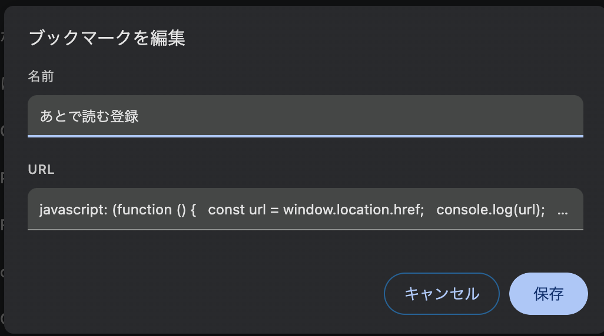
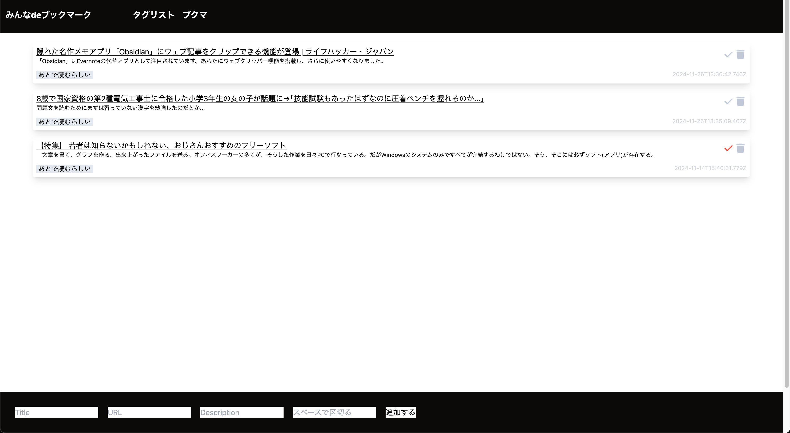

# 個人使用を想定していたブックマークアプリ

## 使用技術

framework → Next.js
DB → Postgresql
ORM → Prisma

## 導入方法

使用にはブックマークレットの登録が必要です。

### ブックマークレットの登録方法

①Web ブラウザでブックマーク登録画面を開く
② 登録名は自由に決めても良い
③URL 部分は bookmark.js のコードを丸ごとコピーし URL の部分に貼り付ける

## ローカル実行方法

git clone して npm install して npm run start すれば動くはず
